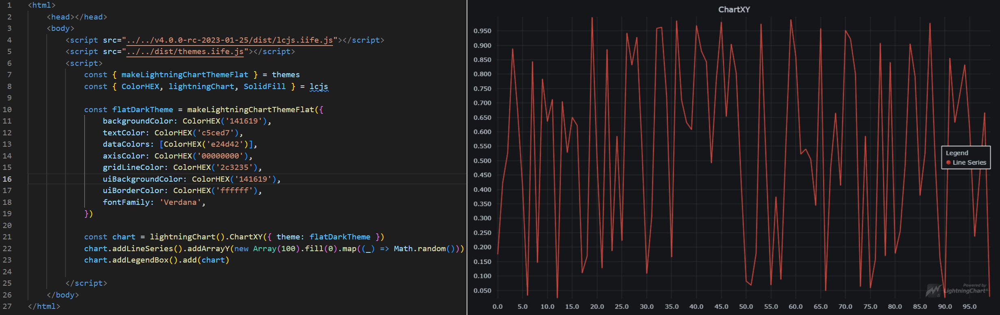
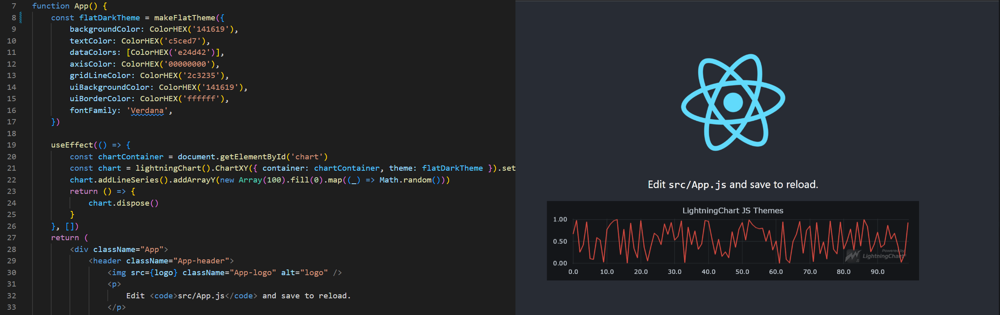
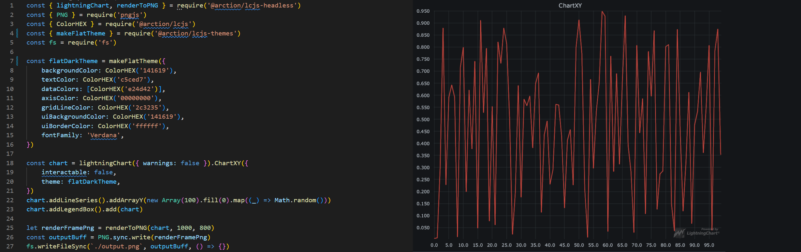

# Open-source Themes package for LightningChart JS

-   Provides tools and ready-made options for customizing LightningChart JS colors and styles
-   Helps with kicking off your own custom themes development by checking through the open-source repository
-   No need to wait for new LightningChart JS versions to get updates for themes, colorization and styling

## Usage

```sh
npm i @arction/lcjs-themes
```

```ts
// Using pre-built open-source themes
import { flatThemeDark } from '@arction/lcjs-themes'
import { lightningChart } from '@arction/lcjs'

const chart = lightningChart().ChartXY({ theme: flatThemeDark })
```

```ts
// Creating customized theme using open-source theme factories
import { makeFlatTheme } from '@arction/lcjs-themes'
import { lightningChart, ColorHEX } from '@arction/lcjs'

const myCustomTheme = makeFlatTheme({
    isDark: true,
    fontFamily: 'Segoe UI, -apple-system, Verdana, Helvetica',
    backgroundColor: ColorHEX('#181818ff'),
    textColor: ColorHEX('#ffffc8ff'),
    dataColors: [ColorHEX('#ffff5b'), ColorHEX('#ffcd5b'), ColorHEX('#ff9b5b')],
    axisColor: ColorHEX('#00000000'),
    gridLineColor: ColorHEX('#303030ff'),
    uiBackgroundColor: ColorHEX('#161616ff'),
    uiBorderColor: ColorHEX('#ffffff'),
    dashboardSplitterColor: ColorHEX('#2d2d2dff'),
})

const chart = lightningChart().ChartXY({ theme: myCustomTheme })
```

You can also use the included [no-code editor](https://arction.github.io/lcjs-themes/) for making custom themes without coding.

See [CHANGELOG](https://github.com/Arction/lcjs-themes/blob/main/CHANGELOG.md) for latest additions to package contents.

## Examples

See [examples](https://github.com/Arction/lcjs-themes/blob/main/examples/) on how to use themes in different scenarios:

### HTML/JS



### React



### Headless



Learn more about LightningChart JS [on our web site](https://lightningchart.com/js-charts/).

## Support Table

`lcjs-themes` is used together with the main chart library [`@arction/lcjs`](https://www.npmjs.com/package/@arction/lcjs).
Use the below support table to find what version of `lcjs-themes` is compatible with `lcjs`.

| lcjs           | lcjs-themes   |
| -------------- | ------------- |
| ^5.0.0         | ^3.0.0        |
| 4.2.x          | 2.1.x         |
| 4.1.x          | 2.0.x         |
| 4.0.0 - 4.0.2  | 1.0.x - 1.1.x |
| Anything older | No support    |

## Contribute

Suggest edits and additions with [GitHub Issues](https://github.com/Arction/lcjs-themes/issues)

Suggest integrating your own code changes with [GitHub Pull Requests](https://github.com/Arction/lcjs-themes/pulls)

Or get directly in touch with the creators by leaving a general inquiry at our [web site](https://lightningchart.com/contact/).
